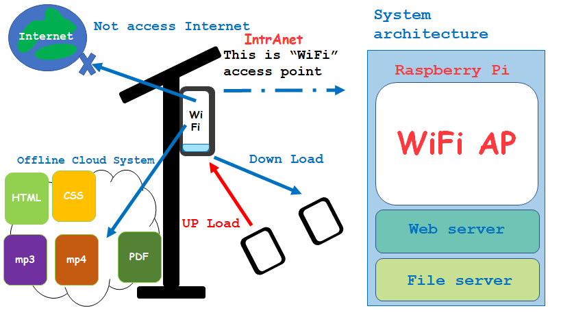

<title>
JO SPOT Jackie Green
</title> 

# I'm here
<!--
 

 
-->

 
---
## Cloud innovator 
**Jackie Green**

**Email: jackieg25@mail.ru**

I am interested in social issues and am working on solving them using technology.  So far, for example, in order to solve a few problems in Cambodian libraries, I made an electronic library of copyright-free books with Raspberry Pi and conducted a project at a Cambodian high school.  In this way, we are working to solve social issues using technology.  

---

**Past activities and Projects**
- [Past activities](page1.md)
- [Projects](https://jackiegreenwifi.github.io/jackiewiki/)
  
---
**Contact**  
Email: jackieg25@mail.ru  

活動の写真ここにあります→
   [PHOTO](page5.md)

 
---

IoT, Smart City, WiFi, 情報通信インフラ, インターネット,　教育, 発展途上国、数学、物理学、情報教育、Raspberry Piを使った教育、発展途上国のパソコン教育支援、カンボジア教育支援、JO SPOT、独立的分散型情報WiFiインフラ JO SPOT、トラフィック量の増加によるコンテンツへのアクセスの問題の解決案がJO SPOT 独立的分散型情報WiFiインフラのコンテンツオフロードにより解決できる、コンテンツオフロード、Cloud, 電力供給インフラ、電動アシスト自転車とソーラーパネルを使った電力供給インフラ、ミャンマーやカンボジアの学校見学、発展途上国のインターネットにアクセスできない村での情報通信インフラ、STEAM教育、アート、ART、デザイン、Design、
 

