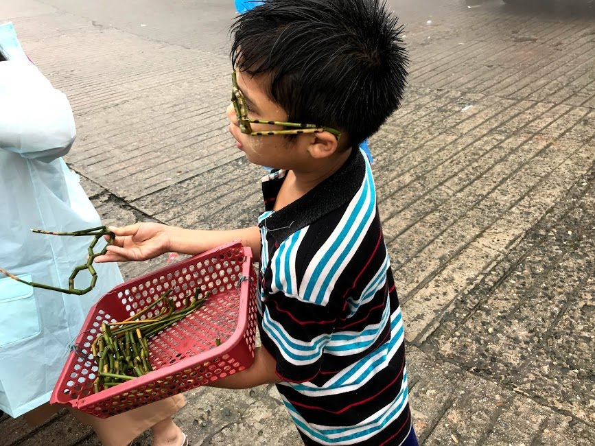

# 経歴と今までの活動
経歴と今までの活動

# ∇NOW JO SPOT ← 2018 PowIs ← 2017 ENERGY GRID 

大学に入学してから主に３つのプロジェクトに取り組んでいます。私の夢は社会問題をアートとテクノロジーを使って課題解決することです。

**ENERGY GRID 2017 **   
2017年、私は大学一年生のとき、ビジネスアイディアコンテストに出場しました。その時のテーマは、「エネルギー問題の解決」でした。私の所属するチームは、ミャンマーで電動アシスト自転車とソーラーパネルを使って電力供給インフラの構築を提案しました。

チーム名：ENERGY GRID
プロジェクト名：PowIs Project

"PowIs"の由来は"Power"、"island"の単語をつなげて"PowIs　Project"にしました。

課題：エネルギー問題
解決案
私達は発展途上国のエネルギー問題を解決することを考えました。私達は、日本から近い東南アジアの国の中で選ぶことにしました。まずはじめに東南アジアの国の中での電力供給不足している国を選びました。1位がインドネシア、2位がミャンマーでした。インドネシアは島が多いため電力供給インフラの構築が厳しいと考えました。そのため、ミャンマーにしました。

電力供給不足の問題を電力アシスト自転車とソーラーパネルを使って解決しようとしたのです。最近の電気自動車は従来の使い道（家で充電して外に行く）とは違い、外で充電して家の電気にする。

ここからわかることは、電気自動車は「外→家」に電気を運ぶこと、そしてインフラになっているということです。この考え方を応用し電動アシスト自転車を電力供給インフラにしたいと考えました。

Step1ミャンマーなど、電力供給インフラのない地域の山の上にポールを立てソーラーパネルを乗せポールの下にあるバッテリーに充電する。

Step2ユーザーは電動アシスト自転車に乗り、ポールに行きバッテリーを持って自宅に帰る。そして、自宅の電力とする。

**PowIs 2018 **   
2018年、チーム名を"ENERGY GRID"から"PowIs"に変えました。PowIs Projectを実現するためミャンマーに現地調査に行きました。現地調査では電力供給以外にも「医療」や「教育」、「インフラ」についても調査しました。   
   
   

こちらの写真はミャンマーの子供の写真です。小学生のこの少年はお金を稼ぐためお土産などを外国人観光客に売っています。このとき、この少年が売っていたものは竹で作ったメガネです。１つあたり約100円で売られていました。彼らは生活費を稼ぐため勉強の時間も削っている。そこで感じたことが、学校に行くスタイルの学習方法ではなく、自宅などどこでも学習できるLMSが必要だと感じました。    
   
   
**JO SPOT 2020**   
2019年、2020年東京オリンピックのときのインターネット接続のトラフィック量の増加を予想し、コンテンツオフロードを提案しました。そのWiFi SPOTの名前を"JO SPOT"にしました。JO SPOTの実証実験を2019年東京理科大学のオープンキャンパスで行い成功しました。JO SPOTをカンボジアの教育向けに改良し、「Study SPOT」としてカンボジアで著作権フリーのPDFの本を提供しました。今後は、新しいLMSの開発に取り組んでいる。3月にカンボジアでプロジェクト予定。

_東京オリンピックのトラフィック量の増加_
東京オリンピックのとき日本から東京へ行く人、そして海外からの観光客の_急激な増加_により、インターネットのトラフィック量の増加、そして、混雑を予想した。

解決案
コンテンツをオフロードする。
インターネットに上がっているコンテンツをWiFi APをサーバー化しコンテンツオフロードすることで接続の混雑を回避できるという提案です。

詳細は古いHP→[masatoyoshi.github.io](masatoyoshi.github.io)

